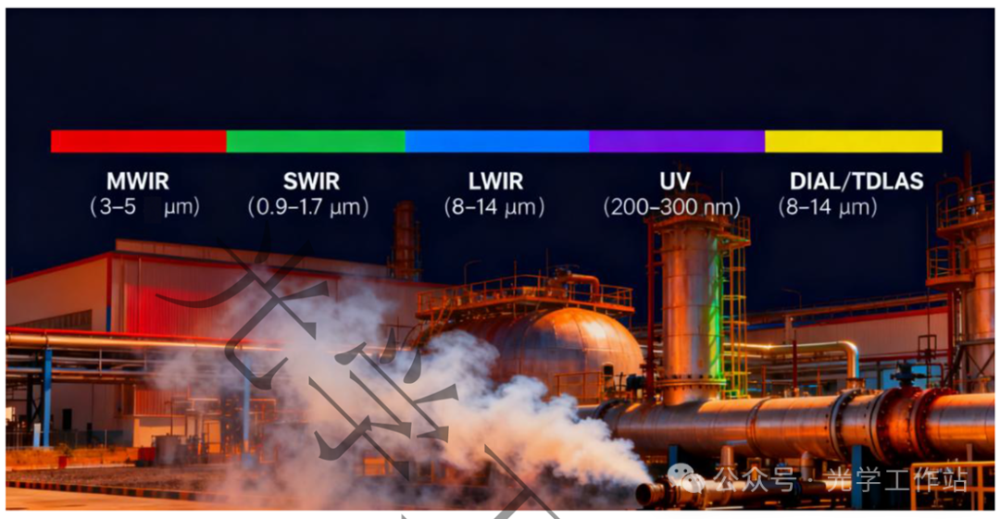
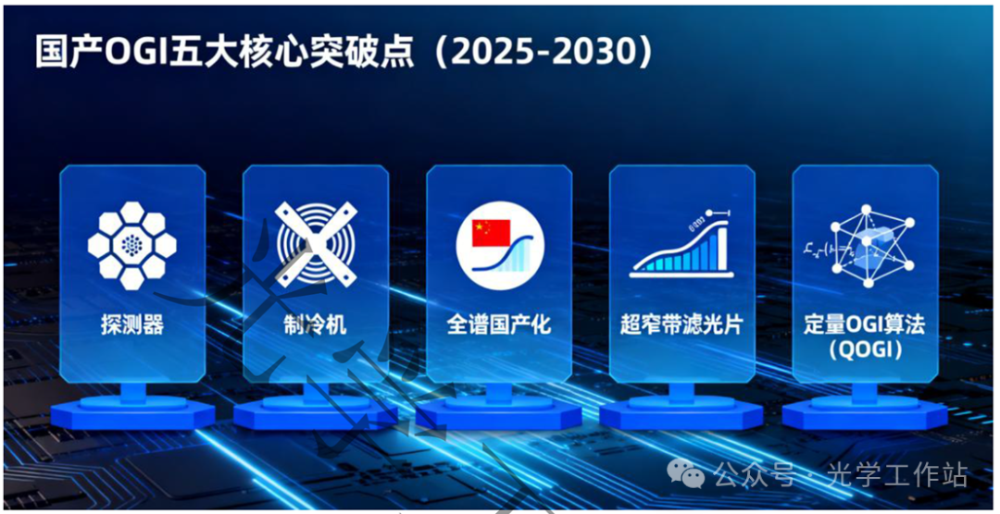
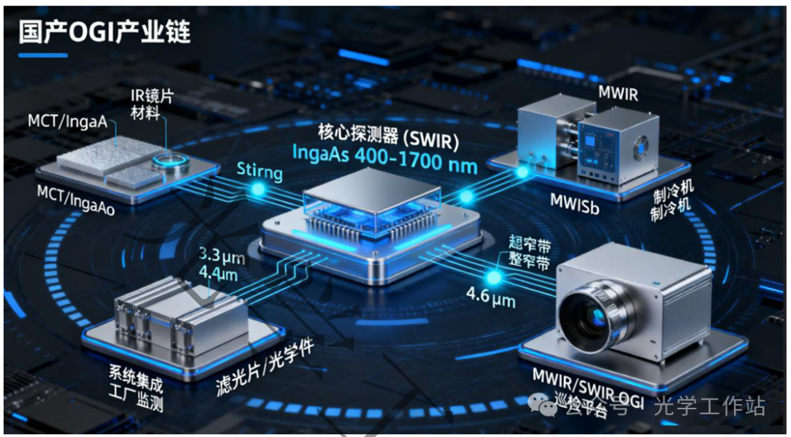
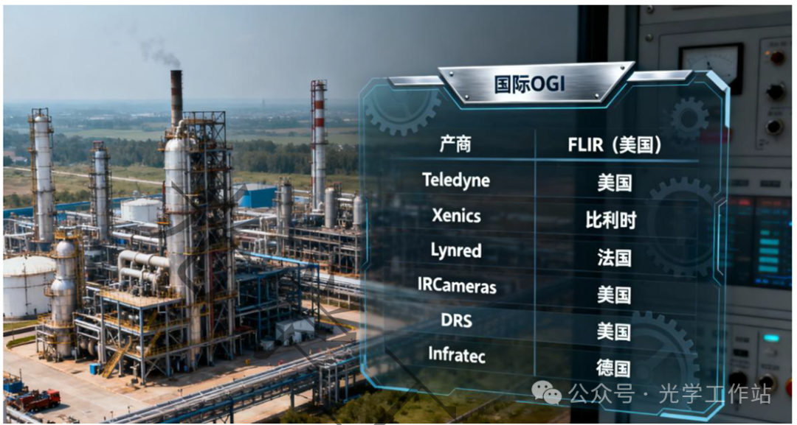
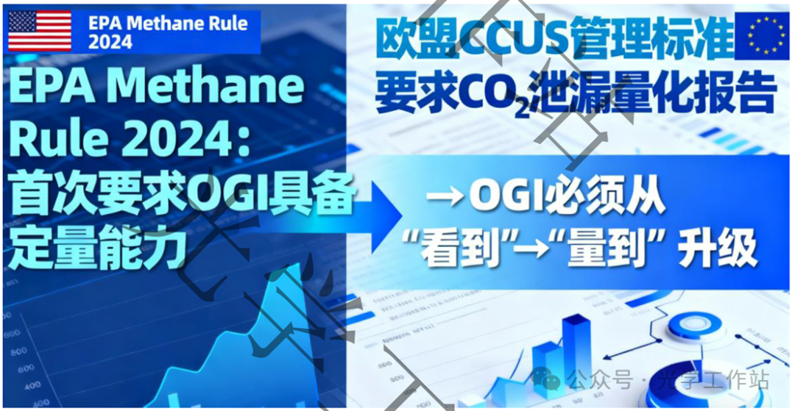
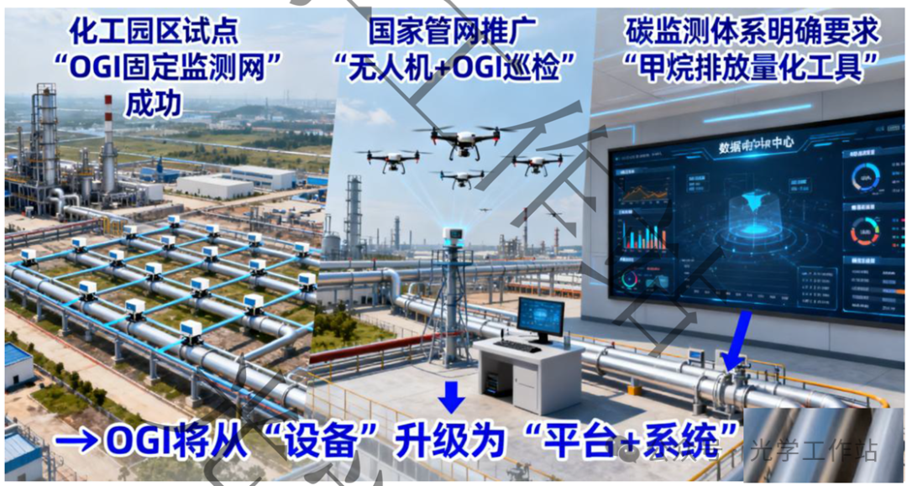

---
title: "国产 OGI 技术发展全景：2025-2030 路线图"
date: 2026-04-08T19:10:00+08:00
draft: false
summary: "系统梳理 OGI 的技术原理、国内热点、关键突破点、产业链格局与 2030 趋势判断。"
tags:
  - OGI
  - 甲烷监测
  - 红外遥感
  - 定量反演
  - 产业分析
---

## 1 介绍

> 光学气体成像（Optical Gas Imaging, OGI）利用气体在红外或紫外波段吸收特性的差异，通过中红外（MWIR）、短波红外（SWIR）或紫外成像，实现对气体泄漏的可视化检测。OGI 在石油石化、天然气长输管道、化工园区、环保监管与军工侦察（CBRN、尾焰、烟幕）等领域具有不可替代的价值。

## 2 OGI 技术概述

> 整个波段

核心硬件包括：**探测器、制冷机、滤光片、光学镜头、AI 算法**。

## 3 国内 OGI 技术热点

当前国内关注的关键主题包括：

- **甲烷 / VOC 泄漏可视化（MWIR）**
- **无人机轻量化 OGI（SWIR）**
- **OGI 定量化（QOGI）**
- **超窄带滤光片国产化**
- **多模态（OGI + 热像 + 可见光）融合**
- **战场态势感知（烟幕、尾焰、化学剂）**

## 4 国产 OGI 关键突破点

> 五大核心突破点

| 序号 | 关键突破点 | 当前瓶颈 (2025) | 2025 阶段目标 | 2026 阶段目标 | 2027-2028 阶段目标 | 2029-2030 阶段目标 (2030 总目标) |
| --- | --- | --- | --- | --- | --- | --- |
| 1 | MCT 冷却探测器 | NETD 偏高；640 阵列成熟但 1024 不足 | 320/640 阵列工程化稳定量产；冷却机/ROIC 配套成熟 | 完成 1024×1024 工程样机；小规模试点 | 1024×768 / 1024×1024 性能优化，实现小批量工程应用 | 1024×1024 工程化量产；NETD <20 mK，接近国际先进 |
| 2 | Stirling 制冷机 | 寿命仅 8,000-12,000 h | 国产制冷机稳定应用于工业 OGI | 寿命提升至 12,000-15,000 h；噪声/振动降低 | 寿命达 15,000-18,000 h；可靠性验证体系完善 | >20,000 h；满足固定监测与军工高可靠性要求 |
| 3 | SWIR 全谱国产化 (InGaAs) | 640 成熟；1280 在量产中 | 640×512 国产成熟，用于固定/移动 OGI | 1280×1024 实用化，进入 UAV 巡检主力 | 多光谱 SWIR (VIS-SWIR) 量产；夜视+烟雾穿透提升 | 2K 面阵量产；成本下降 30-50%；成为 UAV 主流探测器 |
| 4 | 超窄带滤光片 | <40 nm 可量产；中心波长精度有限 | 40-80 nm 工程化成熟；OGI 基础应用广 | 多滤光片切换 (CH4/VOC/CO) 结构成熟 | 成功量产 <30 nm 超窄带滤光片；精度/透过率提升 | <20 nm、OD4-OD5 标准化；定量 OGI 标配器件 |
| 5 | 定量 OGI (QOGI) 算法体系 | 无统一数据集，误报率高 | AI 羽流检测（定性检测稳定化） | QOGI 1.0 初级定量：相对泄漏量估计 | QOGI 2.0 工程化定量：深度学习 + 物理模型；kg/h 反演 | QOGI 3.0 国标级定量：建立国家标准；支持碳核查与 CCUS |
| 附 | T2SL (二类超晶格 MWIR/LWIR 探测器) | 外延周期多（>1000 层）一致性不足；ROIC 匹配不成熟 | 完成 640×512 T2SL 原型样机；验证初步 MWIR 灵敏度 | 优化外延材料体系，提升均匀性；640→1024 工程型机突破 | 形成 1024×1024 T2SL 原型机；NETD、暗电流接近中端 MCT | 1280×1024 工程化样机；可满足工业/军工应用；成为国产 MWIR 战略备份路线 |

## 5 红外成像光谱发展路线

> 发展路线

| 阶段 | SWIR (短波红外) | MWIR (中波红外) | 光学件 | 算法 | 应用领域 |
| --- | --- | --- | --- | --- | --- |
| 2025 | 640×512 | 320/640 稳定 | 普通带宽成熟 | AI 羽流检测 | 工厂巡检、车载 |
| 2026 | 1280×1024 | 制冷机寿命提升 | 多滤光片切换 | 初级定量 | 环保、化工 |
| 2027-2028 | 多光谱 SWIR | 1024×768 研发突破 | <30 nm | 工程化定量 | UAV 巡线、CCUS |
| 2029-2030 | 2K 面阵 | 1024×1024 工程化 | <20 nm 标准化 | 国标级定量 | 固定监测、CBRN |

## 6 国产 OGI 产业链全景

> 产业链全景

## 7 国际主流厂商对标分析

| 环节 | 内容 | 国内代表企业 | 说明 |
| --- | --- | --- | --- |
| 上游材料 | 外延片 (MCT/InGaAs)、IR 镜片材料 | 三安光电、北方华创 | 外延一致性仍是瓶颈 |
| 核心探测器 (SWIR) | InGaAs 400–1700 nm | GHOPTO（国惠）、泓科光电 | 技术成熟、国产优势强 |
| 核心探测器 (MWIR) | MCT/InSb | GST（高德）、航天系、Ulirvision（优利德） | 高端面阵仍在突破 |
| 制冷机 | Stirling（斯特林制冷机） | 陕西伏泰、航天体系 | 最大短板 |
| 滤光片/光学件 | 3.3 μm、4.6 μm、超窄带 | Multi IR、Ant、WaveteK | 国产成熟 |
| 整机产品 | MWIR/SWIR OGI 相机 | GST、Ulirvision、GuideIR（高德） | 覆盖工业/安防 |
| 系统集成 | 工厂监测、巡检平台 | 和利时、中控、中石油装备 | 与 SCADA/DCS 集成明显 |

## 8 国内外差距总结

| 厂商 | 国家 | 优势 | 备注 |
| --- | --- | --- | --- |
| FLIR | 美国 | 工业 OGI 全球第一、算法最成熟 | 行业标准建立者 |
| Teledyne | 美国 | 全链条 MWIR 产业 | MCT 先进 |
| Xenics | 比利时 | SWIR 领先 | 已被 Teledyne 收购 |
| Lynred | 法国 | 全球最强 MCT 外延 | 军用核心供应商 |
| IRCameras | 美国 | 科研级 MWIR、超高灵敏度 | 高端市场 |
| DRS | 美国 | 最强制冷机 | >30000 h 寿命 |
| Infratec | 德国 | 工业红外系统强者 | 应用广 |

## 9 未来趋势

| 编号 | 趋势方向 | 核心驱动力 | 2030 预期 |
| --- | --- | --- | --- |
| T1 | UAV + 轻量化 OGI | SWIR 成熟、巡检需求 | 市占率 35–45% |
| T2 | 工厂固定 OGI 网络 | 安全监管升级 | 每厂 10–30 台 |
| T3 | OGI 定量化 (QOGI) | EPA/CCUS/碳核查 | 泄漏量化 kg/h |
| T4 | 多模态融合 | 降误报、融入风险感知 | 主流产品≥2传感器 |
| T5 | CBRN + 战场态势感知 | 战场多模态需求 | 装备化应用 |
| T6 | 国产化自主可控 | 全国产链成熟 | 出口能力提升 |

## 10 趋势（国际政策 + 工程数据 + 军事需求）

### 10.1 国际形势

- **EPA Methane Rule 2024：首次要求 OGI 具备“定量能力”**
- **欧盟 CCUS 管理标准：要求 CO2 泄漏量化报告**
- OGI 必须从“看到”升级到“量到”。

### 10.2 工程应用趋势

- **无人机 OGI 全球采购增速 >50%/年**
- **北美油田 38% 巡检已由 UAV 完成**
- **国产 SWIR OGI 成本下降 30–50%**
- **UAV + OGI 在效率和安全性上明显优于人工巡检**

### 10.3 军事需求

国外已在多个场景部署 OGI：

| 应用 | 国家/地区 | 波段 | 优势 |
| --- | --- | --- | --- |
| 尾焰探测 | 美国 | MWIR | 早期识别喷流 |
| 化学剂侦察 | 北约 | UV-DIAL | 远距识别 |
| 烟幕/伪装识别 | 欧盟 | SWIR | 看穿烟雾 |

### 10.4 国内行业趋势

- 化工园区试点“OGI 固定监测网”成功
- 国家管网推广“无人机 + OGI 巡检”
- 碳监测体系明确要求“甲烷排放量化工具”
- OGI 将从“设备”升级为“平台 + 系统”能力

## 11 总结

2025–2030 年将是国产 OGI 从“追赶期”跨越到“体系化突破期”的关键阶段：

- **SWIR：国产全面成熟，具备竞争力**
- **MWIR：MCT + 制冷机仍是核心技术瓶颈**
- **滤光片：国产已领先**
- **算法：未来决胜点在定量化（QOGI）**
- **应用：从巡检扩展到固定监测与战场态势感知**
- **产业链：正在形成自主可控体系**

随着国产探测器、光学件、算法与系统能力成熟，中国将在 2030 年前后具备完整的 OGI 自主可控能力，并有机会在 SWIR、UAV、定量化 OGI 等方向形成国际优势。

---
来源微信公众号：光学工作站

